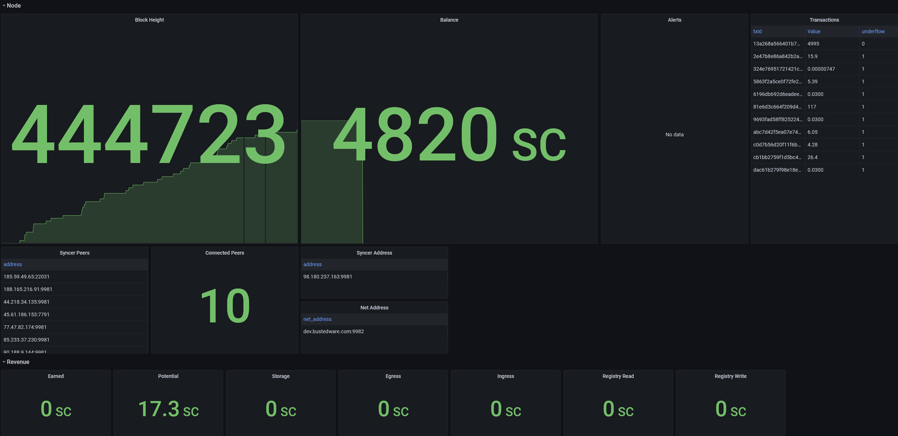
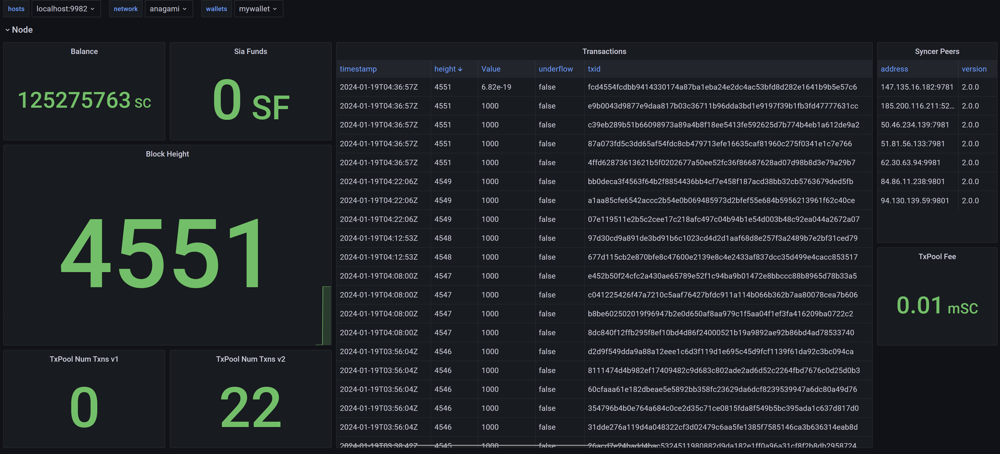

# Sia Monitoring

*special note: these dashboards are built from forks of hostd, renterd, and walletd. here are links to each fork*
- *hostd: https://github.com/bustedware/hostd*
- *renterd: https://github.com/bustedware/renterd*
- *walletd: https://github.com/bustedware/walletd*

## Quick Start
1. configure `siagrafana.json` with your hostd, renterd, walletd, and grafana information
2. run `python sia-to-prometheus-config.py` to generate prometheus configurations for each service
3. run `python sia-to-grafana-config.py` to deploy dashboards to grafana

For a detailed guide continue reading this document

## Requirements
These are the versions of Prometheus and Grafana I ran during development. It's possible it will work with other versions.
- Prometheus 2.47.1
- Grafana v8.4.4

## Dashboards
### hostd


### walletd


## Prometheus Data Collection
1. Review the array of hosts in `siagrafana.json`. Configure `hostd_hosts`, `renterd_hosts`, and `walletd_hosts` according to your infrastructure. You can ignore `grafana_host` for now.

2. Run `python sia-to-prometheus-config.py` to generate hostd, renterd, and walletd prometheus yml configurations.
    - prometheus.hostd.yml
    - prometheus.renterd.yml
    - prometheus.walletd.yml

3. Run Prometheus data collectors

```bash
prometheus --config.file="prometheus.hostd.yml" --web.listen-address="0.0.0.0:9090" --storage.tsdb.path="hostd"
prometheus --config.file="prometheus.walletd.yml" --web.listen-address="0.0.0.0:10090" --storage.tsdb.path="walletd"
prometheus --config.file="prometheus.renterd.yml" --web.listen-address="0.0.0.0:11090" --storage.tsdb.path="renterd"
```

## Grafana Dashboards
1. Set the value for `grafana_host` in the `siagrafana.json` file.

2. Create a new API key for Grafana
    - Login to your grafana host and go to `Configuration` > `API keys`
    - Click `Add API key`
    - Name: _(give the key whatever name you want)_
    - Role: `Admin`
    - Time to live: `100y` _(or whatever you want. 100y for non expiring key)_

3. Set the value for `grafana_api_token` in the `siagrafana.json` file using the API key from step 2

4. Run `python sia-to-grafana-config.py` to create `hostd`, `walletd`, and `renterd(soon)` dashboards in your configured Grafana host.
    - This script reads the `grafana.<service>.template.json` to generate a dashboard from
    - This script also generates the following files which are used during the API calls for creating these dashboards. If you have any issues with the dashboard being created automatically these files would be good to inspect.
        - grafana.hostd.json
        - grafana.renterd.json (soon)
        - grafana.walletd.json

#### Donations

**SIA**: `1d2873a328df4f998185a46ace392279c9d9170d9e3d6ce5c83da7c0b1c681576411b010898e`

Scan it with your crypto wallet:


**BTC**: `3AeQ5E9g7yyGqhZD44Swdh694Lp9xLTo5q`

Scan it with your crypto wallet:


**ETH**: `0x03b1dE4f3Fa5894902F77D7AB92c58b7edD40456`

Scan it with your crypto wallet:
