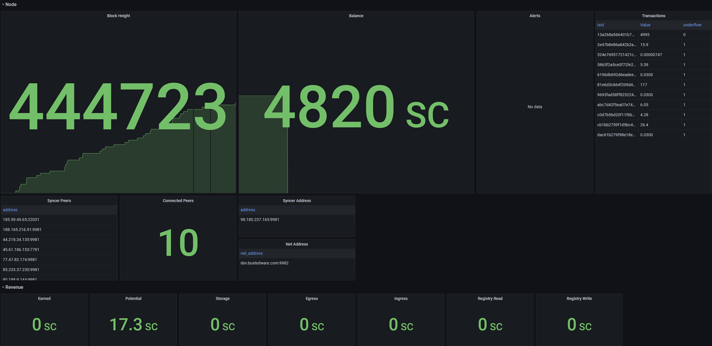
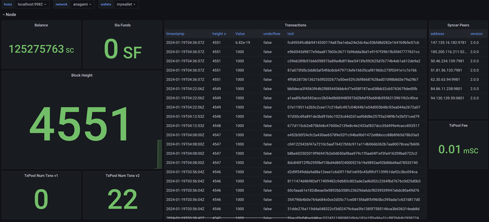

# Sia Monitoring

*special note: these dashboards are built from forks of hostd, renterd, and walletd. here are links to each fork*
- *hostd: https://github.com/bustedware/hostd*
- *renterd: https://github.com/bustedware/renterd*
- *walletd: https://github.com/bustedware/walletd*

# Quick Start
1. configure `siagrafana.json` with your hostd, renterd, walletd, and grafana information
2. run `python generate-configs.py` to generate prometheus configurations for each service.
3. in grafana create prometheus datasources according to the following:
    - create a single prometheus datasource named `sia` if using `prometheus.yml`
    - create a prometheus datasource named `hostd`, `renterd`, and `walletd` after each service you plan to monitor when running with `prometheus.<service>.yml`
3. run `python generate-dashboards.py` to deploy dashboards to grafana

For a detailed guide continue reading this document

## Requirements
These are the versions of Prometheus and Grafana I ran during development. It's possible it will work with other versions.
- Prometheus 2.47.1
- Grafana v8.4.4

## Dashboards
### hostd


### renterd
*coming soon*

### walletd


## Prometheus Data Collection
1. Review the array of hosts in `siagrafana.json`. Configure `hostd_hosts`, `renterd_hosts`, and `walletd_hosts` according to your infrastructure. You can ignore `grafana_host` for now.

2. Run `python generate-configs.py` to generate hostd, renterd, walletd, and combined prometheus yml configurations.
    - prometheus.hostd.yml
    - prometheus.renterd.yml
    - prometheus.walletd.yml
    - prometheus.yml

3. Run Prometheus data collectors

Example prometheus commands running for each service
```bash
prometheus --config.file="prometheus.hostd.yml" --web.listen-address="0.0.0.0:9090" --storage.tsdb.path="hostd"
prometheus --config.file="prometheus.walletd.yml" --web.listen-address="0.0.0.0:10090" --storage.tsdb.path="walletd"
prometheus --config.file="prometheus.renterd.yml" --web.listen-address="0.0.0.0:11090" --storage.tsdb.path="renterd"
```

Example prometheus command running for combind services
```bash
prometheus --config.file="prometheus.yml" --web.listen-address="0.0.0.0:9090" --storage.tsdb.path="sia"
```

## Grafana Datasources
The `generate-dashboards.py` script will search for datasources in Grafana named `hostd`, `renterd`, `walletd`, and `sia`. If any datasources are named `sia`, the dashboards that are created will all use this datasource. If `sia` is not a present datasource, the dashboards are created with their respectively named datasource `hostd`, `renterd`, and `walletd`

The datasources **must** be named `hostd`, `renterd`, `walletd`, or `sia`.

To create a grafana datasource:
1. Login to Grafana and go to `Configuration` > `Data sources`
2. Click the blue `Add data source` button in the upper right
3. Search for or select `Prometheus`
4. Enter the `Name` of the datasource.
5. Enter your prometheus `URL`. ie `http://localhost:9090`
6. Near the button, for `HTTP Method` select `GET`
7. Click the blue `Save & test` button at the bottom

## Grafana Dashboards
The `generate-dashboards.py` script will use the `grafana.<service>.template.json` files as templates when making API calls to Grafana for creating dashboards. Any updates made to the dashboards within the Grafana UI can be brought back to these template files. See the updating templates section for more details.

Follow these steps to create dashboards in Grafana for each service that has any hosts defined in `siagrafana.json`:
1. Set the value for `grafana_host` in the `siagrafana.json` file.

2. Create a new API key for Grafana
    - Login to your grafana host and go to `Configuration` > `API keys`
    - Click `Add API key`
    - Name: _(give the key whatever name you want)_
    - Role: `Admin`
    - Time to live: `100y` _(or whatever you want. 100y for non expiring key)_

3. Set the value for `grafana_api_key` in the `siagrafana.json` file using the API key from step 2

4. Run `python generate-dashboards.py` to create `hostd`, `walletd`, and `renterd(soon)` dashboards in your configured Grafana host.
    - This script reads the `grafana.<service>.template.json` to generate a dashboard from

*note: This script also generates the following files, the contents of which are used during the API calls for creating these dashboards. If you have any issues with the dashboard being created these files would be good to inspect.*

    - grafana.hostd.json
    - grafana.renterd.json (soon)
    - grafana.walletd.json

## Updating Dashboard Templates
After making changes to a dashboard you can export those changes and save it in the `grafana.<service>.template.json` file after making the following updates to it:
1. `"id": null` root level of document
2. `"uid": null` root level of document
3. All of the `datasource.uid` should be set to `"uid": "<DSID>"`

#### Donations

Thank you for your support!

**SIA**: `1d2873a328df4f998185a46ace392279c9d9170d9e3d6ce5c83da7c0b1c681576411b010898e`


---------------------------------------------

**BTC**: `3AeQ5E9g7yyGqhZD44Swdh694Lp9xLTo5q`


---------------------------------------------

**ETH**: `0x03b1dE4f3Fa5894902F77D7AB92c58b7edD40456`

